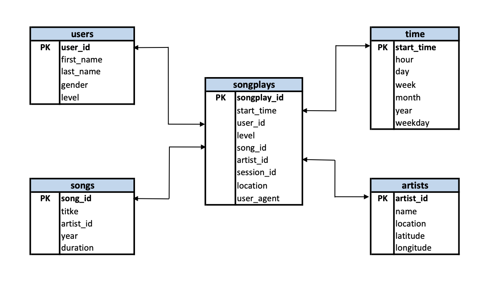

## Data Modeling - Sparkify Postgres ETL

An imaginery startup called Sparkify wants to analyze the data they've been collecting on songs and user activity on their new music streaming app. The analytics team is particularly interested in understanding what songs users are listening to. Currently, they don't have an easy way to query their data, which resides in a directory of JSON logs on user activity on the app, as well as a directory with JSON metadata on the songs in their app.

In this project, we'll create a Postgres database with tables designed to optimize queries on song play analysis. The task is to create a star schema for Postgres and develop an ETL pipleine which will transfer the data from local files to the database.

### Requirements for running locally
- Python3 
- Jupiter notebook

### Database Schema Design

Below is the database schema for the Sparkify databse:

### The project file structure

In order to perform data modeling and ETL, 5 files were created as below:
 - `sql_queries.py` - This files contains a query repository to use throughout the ETL process
 - `create_tables.py` - This file is reponsible for creating tables and deleting tables in the Sparkify database
 - `etl.py` - This file is responsible for the main ETL process (extracting and inserting data into the tables)
 - `etl.ipynb` - This python notebook was written to develop the logic behind the `etl.py` process
 - `test.ipynb` - This notebook was used to test the ETL process to make sure that it works
